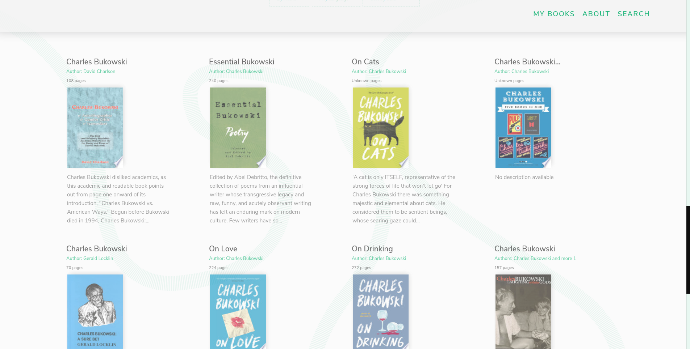

# Ukwu - Bookfinder Website 

### 🚀 Technologies used
1. The application was built using Javascript, HTML and SASS. The mainly goal was the use of APIs and DOM Manipulation.
2. This project uses *Google Books API*, *Webpack*, *Babel*, *MVC Design Pattern* 

## Images Preview
### A Search by Author

### Filters Options

### Modal preview of a book.

